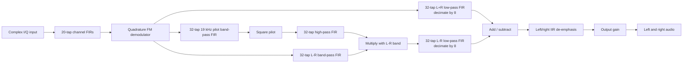

# Streaming FM Stereo Receiver

A synthesizable SystemVerilog implementation of a fixed-point FM stereo receiver. The design accepts complex baseband I/Q samples, demodulates the FM signal, separates the mono and stereo-difference channels, and produces signed 32-bit left and right audio samples.

The receiver is organized as a backpressure-aware streaming datapath. Valid/ready interfaces connect the processing core, while 128-entry synchronous FIFOs buffer the top-level input, the left and right outputs, and the branches between DSP stages.

Designed by Zach Tey, Gautham Anne
Northwestern University, 2026

## Highlights

- Synthesizable, parameterized SystemVerilog DSP blocks
- Signed 32-bit fixed-point samples and coefficients with 10 fractional bits
- Parameterized FIR implementation with configurable tap count, decimation, coefficient set, accumulator width, and scaling
- Quadrature FM demodulation using the phase difference between consecutive complex samples
- Stereo pilot recovery and `L+R` / `L-R` channel extraction
- Two-tap IIR de-emphasis on both reconstructed audio channels
- FIFO buffering and backpressure propagation throughout the receiver
- Directed module-level testbenches and a UVM end-to-end environment
- Bit-exact comparison against outputs from a C++ reference model

## Signal chain



The package constants model a 64 MHz ADC with a USRP decimation factor of 250, producing a 256 ksample/s quadrature stream. The audio FIRs decimate by eight to produce a nominal 32 ksample/s stereo output.

### FM demodulation

The demodulator estimates the phase change between adjacent complex samples:

```text
phase[n] = angle(x[n] * conjugate(x[n-1]))
```

It implements the conjugate product, a fixed-point `atan2` approximation, sequential division, and output gain as a multicycle FSM. The wrapper exposes the block as a valid/ready stream and holds results stable when the downstream pipeline stalls.

### Stereo decoding

After FM demodulation, the multiplexed baseband signal is split into three paths:

1. A low-pass path extracts the mono `L+R` signal.
2. A band-pass path extracts the double-sideband suppressed-carrier `L-R` signal.
3. A pilot path isolates the 19 kHz stereo pilot. Squaring and high-pass filtering recover the 38 kHz subcarrier used to translate `L-R` to baseband.

The receiver reconstructs the channels as `left = (L+R) + (L-R)` and `right = (L+R) - (L-R)`, then applies de-emphasis and output gain.

## Interfaces

The synthesizable top level is `fm_radio_top` in `sv/fm_radio_top.sv`.

| Signal | Direction | Description |
| --- | --- | --- |
| `clock` | Input | Processing clock |
| `reset` | Input | Active-high asynchronous reset |
| `in_din[63:0]` | Input | One I/Q pair: `{I[31:0], Q[31:0]}` |
| `in_wr_en` | Input | Writes an I/Q pair when `in_full` is low |
| `in_full` | Output | Input FIFO cannot accept another sample |
| `out_left_dout[31:0]` | Output | Signed left-channel audio sample |
| `out_left_rd_en` | Input | Reads the left output FIFO |
| `out_left_empty` | Output | Left output FIFO is empty |
| `out_right_dout[31:0]` | Output | Signed right-channel audio sample |
| `out_right_rd_en` | Input | Reads the right output FIFO |
| `out_right_empty` | Output | Right output FIFO is empty |

Left and right outputs are generated as synchronized pairs. Consumers should read both output FIFOs together.

## Verification

The repository contains two complementary verification flows:

- Directed SystemVerilog testbenches exercise the FIR, demodulator, multiplier/gain, add/subtract, IIR, and integrated receiver.
- The UVM environment drives recorded I/Q data through the FIFO interface, monitors paired audio output, and performs an in-order, bit-exact comparison against golden left/right samples generated by the C++ reference model.

The checked-in end-to-end dataset contains:

- 1,048,576 input bytes, representing 262,144 complex 16-bit I/Q samples
- 32,768 expected left-channel samples
- 32,768 expected right-channel samples

The scoreboard reports independent exact-match and mismatch counts for both channels and declares `PASS` only when both mismatch counts are zero.

## Running the simulations

### Requirements

- A SystemVerilog simulator with UVM support
- QuestaSim/ModelSim for the supplied `.do` scripts
- UVM 1.1d for the current UVM compile script
- A C++ compiler if rebuilding the optional UVM DPI library

The supplied scripts were developed with QuestaSim 2019.3 on Linux. The UVM installation path in `sim/testing/fm_radio_uvm.do` and `uvm/Makefile` is machine-specific; update `UVM_INC`, `UVM_HOME`, and `QUESTA_HOME` for your installation before running them elsewhere.

### End-to-end UVM test

Run the script from `sim/` because the testbench opens its input and golden files relative to that directory:

```bash
cd sim
vsim -64 -c -do testing/fm_radio_uvm.do
```

The run writes `sv_left_audio_out.txt` and `sv_right_audio_out.txt`, saves coverage to `fm_radio.ucdb`, and prints the final match/mismatch totals in the transcript.

### Directed tests

The `sim/testing/` directory contains scripts for individual blocks and the integrated design. For example:

```bash
cd sim

# FIR regression
vsim -64 -c -do testing/fir_regression_tb.do

# FM demodulator
vsim -64 -c -do testing/demod_tb.do

# IIR de-emphasis
vsim -64 -c -do testing/iir_tb.do

# Integrated receiver
vsim -64 -c -do testing/fm_radio_tb.do
```

Remove `-c` when running a script interactively in the Questa GUI.

## Reference model and test vectors

`src/` contains the C++ receiver model used to generate the golden intermediate and final results. The vectors in `sim/` make it possible to compare the RTL at individual pipeline boundaries as well as at the final stereo outputs.

Important vector files include:

- `sim/usrp.txt`: byte-oriented recorded I/Q input
- `sim/gold_00_*.txt` through `sim/gold_12_*.txt`: golden values at successive DSP stages
- `sim/gold_12_left_gain.txt`: final expected left audio
- `sim/gold_12_right_gain.txt`: final expected right audio
- `sim/MATLAB_Stages/`: additional stage-level reference data

## Repository layout

```text
streaming_fm_radio/
├── sv/                 # Synthesizable RTL and directed testbenches
│   └── tb/             # Module-level testbenches
├── uvm/                # UVM agent, sequence, monitor, scoreboard, and test
├── sim/                # Questa scripts, coefficients, vectors, and goldens
│   ├── testing/        # Simulation .do files
│   └── MATLAB_Stages/  # Stage-level MATLAB reference results
├── src/                # C++ reference receiver and golden-vector generator
└── syn/                # Synplify project and archived synthesis reports
```

## Synthesis

The `syn/` directory contains a Synplify project for `fm_radio_top` and archived reports. These reports are tool- and target-specific; rerun synthesis with constraints for your target FPGA before quoting timing or resource results.

## Notes

- The fixed-point behavior intentionally includes truncation and selected 32-bit wrap semantics to remain bit-exact with the C++ model.
- FIR accumulators are 48 bits by default, while external samples and coefficients are signed 32-bit values.
- Most pipeline boundaries use 128-entry FIFOs to absorb differences in multicycle stage latency and propagate backpressure safely.
- This repository implements the digital baseband receiver. It expects already-sampled complex I/Q data and does not include an RF tuner, ADC, DAC, or physical FM front end.

